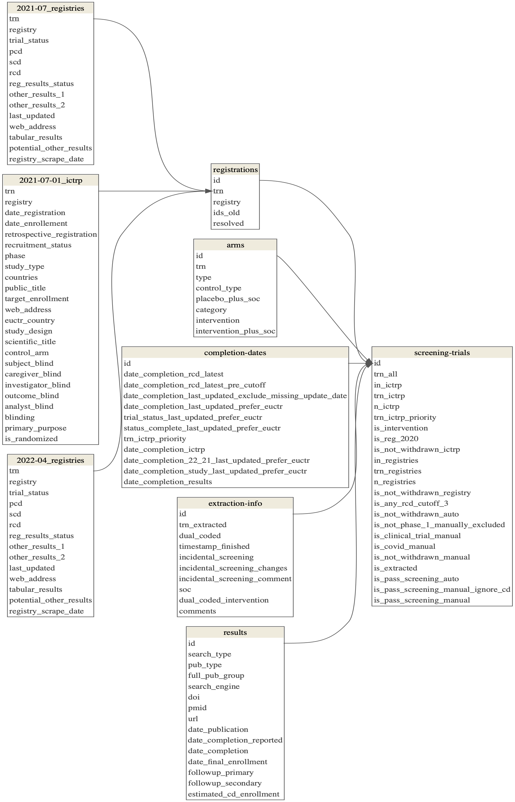

<!-- README.md is generated from README.Rmd. Please edit that file -->

```{r, include = FALSE}
knitr::opts_chunk$set(
  collapse = TRUE,
  comment = "#>",
  echo = FALSE,
  message = FALSE
)
```

# DIRECCT

## Repository Structure

The **`R`** directory contains scripts to create the analysis dataset. It gathers and processes data from both automated (e.g., ictrp, registries) and manual (e.g., trial searches in [numbat](https://numbat.bgcarlisle.com/)) sources. The final resulting data is stored in `data/reporting` and is included when you download (i.e., clone) this repository.

The **`docs`** directory runs and reports the analysis. It uses the data available in `data/reporting` and therefore can be run without running the scripts in the `R` directory. To reproduce the analysis, run `quarto::quarto_render(here::here("docs", "index.qmd"))` in your R console.

The **`data`** directory includes data used in and produced by this study.

-   `manual` contains data manually added to the repository and comprises primarily data quality checks performed by the study team in Google Sheets.
-   `raw` contains data downloaded from other sources by `01_download-data-raw.R` and extractions in Numbat by `03_download-data-numbat.R`. It also contains a snapshot of MedrXiv downloaded by `06_match-full-preprints-articles.R` and used for preprint-article matching.<!--# medrxiv -->
-   `cleaned` contains data after cleaning, including tidying names to for consistency across tables.
-   `processed` contains intermediary data, i.e. with unique database identifiers (`id`) in all tables, after deduplicating cross-registrations, and matched preprint-article results.
-   `reporting` contains the final data for analysis and dissemination.

## `Data` Directory Tree

The remote repository includes `manual` and `reporting` subdirectories. Running the scripts in the `R` directory additionally generates `raw`, `cleaned`, and `processed` subdirectories.

<details>

<summary>Display Data Directory Tree</summary>

```         
├── cleaned
│   ├── 2021-07-01_ictrp.csv
│   ├── 2021-07_registries.csv
│   ├── 2022-04_registries.csv
│   ├── arms.csv
│   ├── registrations.csv
│   ├── results.csv
│   ├── trials.csv
│   └── trials_1.csv
├── manual
│   ├── 2021-07_registries-manual.csv
│   ├── 2022_cross-registrations.csv
│   ├── cleaned-registrations-3.csv
│   ├── crossreg-dedupe_coded.csv
│   ├── crossreg-dedupe_to-code.csv
│   ├── full-results-matching_coded.csv
│   ├── full-results-matching_to-code.csv
│   └── unresolved-crossreg-checks.csv
├── processed
│   ├── completion-dates-results.csv
│   ├── completion-dates.csv
│   ├── deduped-arms.csv
│   ├── deduped-registrations.csv
│   ├── deduped-results.csv
│   ├── deduped-trials.csv
│   ├── matched-results.csv
│   └── screening-trials.csv
├── raw
│   ├── 2020-09-15_auto_results_1.csv
│   ├── 2020-12-16_ictrp.csv
│   ├── 2021-01_registries.csv
│   ├── 2021-02-24_auto_results_2.csv
│   ├── 2021-07-01_ictrp.csv
│   ├── 2021-07-01_ictrp_web.csv
│   ├── 2021-07-14_auto_results_3.csv
│   ├── 2021-07_registries.csv
│   ├── 2022-04_registries.csv
│   ├── 2022-09-17_medrxiv-snapshot.csv
│   ├── numbat
│   │   ├── 2023-07-18
│   │   │   ├── assignments-2.csv
│   │   │   ├── assignments-3.csv
│   │   │   ├── extraction-arms-23.csv
│   │   │   ├── extraction-interventions-23.csv
│   │   │   ├── extraction-keywords-2.csv
│   │   │   ├── extraction-keywords-3.csv
│   │   │   ├── extraction-registrations-2.csv
│   │   │   ├── extraction-registrations-3.csv
│   │   │   ├── extraction-results-2.csv
│   │   │   ├── extraction-results-3.csv
│   │   │   ├── extraction-trials-2.csv
│   │   │   ├── extraction-trials-3.csv
│   │   │   ├── reconciliation-arms-23.csv
│   │   │   ├── reconciliation-interventions-23.csv
│   │   │   ├── reconciliation-keywords-2.csv
│   │   │   ├── reconciliation-keywords-3.csv
│   │   │   ├── reconciliation-registrations-2.csv
│   │   │   ├── reconciliation-registrations-3.csv
│   │   │   ├── reconciliation-results-2.csv
│   │   │   ├── reconciliation-results-3.csv
│   │   │   ├── reconciliation-trials-2.csv
│   │   │   └── reconciliation-trials-3.csv
│   │   ├── numbat-downloads.log
│   │   ├── refset-2.csv
│   │   └── refset-3.csv
│   ├── registrations_1.csv
│   ├── results_1.csv
│   └── trials_1.csv
└── reporting
    ├── 2021-07-01_ictrp.csv
    ├── 2021-07_registries.csv
    ├── 2022-04_registries.csv
    ├── arms.csv
    ├── completion-dates.csv
    ├── extraction-info.csv
    ├── main-analyses
    │   ├── kaplan-meier-preprint-to-article.csv
    │   └── kaplan-meier-time-to-pub.csv
    ├── metadata
    │   ├── codebook.csv
    │   ├── datamodel.pdf
    │   ├── datamodel.png
    │   ├── flow-trials.pdf
    │   └── flow-trials.png
    ├── registrations.csv
    ├── results.csv
    ├── screening-trials.csv
    ├── sensitivity-analyses
    │   ├── kaplan-meier-time-to-pub_22.csv
    │   ├── kaplan-meier-time-to-pub_cd_results.csv
    │   ├── kaplan-meier-time-to-pub_ictrp.csv
    │   ├── kaplan-meier-time-to-pub_latest_completion_status.csv
    │   ├── kaplan-meier-time-to-pub_latest_rcd.csv
    │   └── kaplan-meier-time-to-pub_scd.csv
    └── subgroup-analyses
        ├── kaplan-meier-common-interventions.csv
        ├── kaplan-meier-minimum-standards.csv
        ├── kaplan-meier-preprint-to-article-semester.csv
        └── kaplan-meier-semester.csv
```

</details>

## `Reporting` Data

The output data produced in this study and used for the analysis is available in the `data/reporting` directory.

It comprises several interrelated csv's and functions as a pseudo relational database. Unique trials were assigned a unique `id` (format: "tri" + 5 digits).

### Data Model

{width="800"}

### Data Dictionary: Tables and Codebook

#### Tables

```{r tables}
readr::read_csv(here::here("data", "reporting", "metadata", "tables.csv")) |> 
  knitr::kable()
```

#### Codebook

```{r codebook}
readr::read_csv(here::here("data", "reporting", "metadata", "codebook.csv")) |> 
  knitr::kable()
```

## Trials Screening Flowchart

Our final analysis dataset is screened from `reporting` data in `docs/01_report-screening.R`.

{width="800"}
