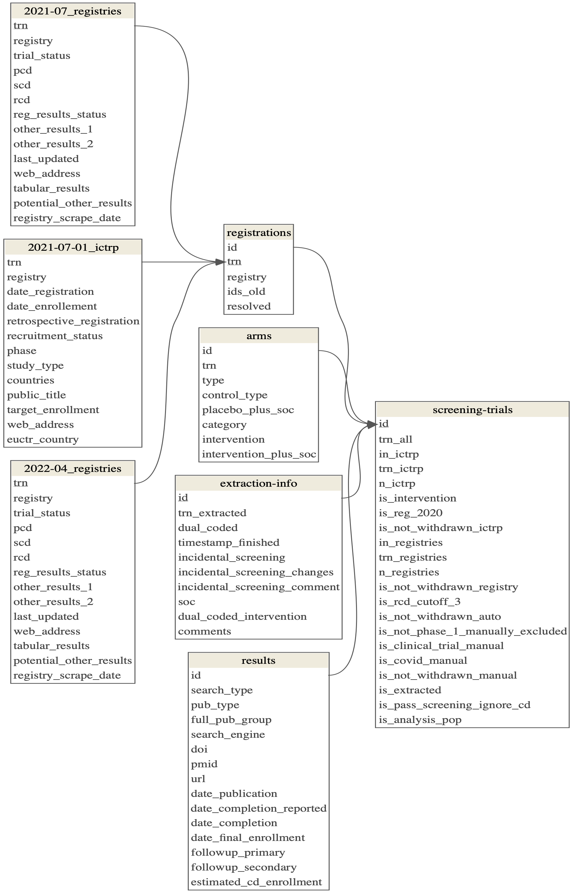
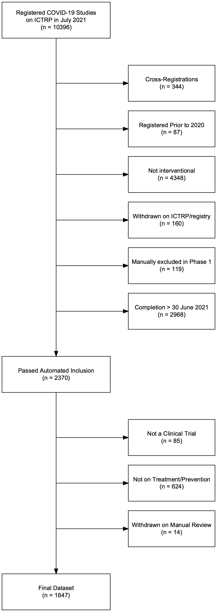

<!-- README.md is generated from README.Rmd. Please edit that file -->

# DIRECCT

## Repository Structure

The **`R`** directory contains scripts to create the analysis dataset.
It gathers and processes data from both automated (e.g., ictrp,
registries) and manual (e.g., trial searches in
[numbat](https://numbat.bgcarlisle.com/)) sources. The final resulting
data is stored in `data/reporting` and is included when you download
(i.e., clone) this repository.

The **`docs`** directory runs and reports the analysis. It uses the data
available in `data/reporting` and therefore can be run without running
the scripts in the `R` directory. To reproduce the analysis, run
`quarto::quarto_render(here::here("docs", "index.qmd"))` in your R
console.

The **`data`** directory includes data used in and produced by this
study.

- `manual` contains data manually added to the repository and comprises
  primarily data quality checks performed by the study team in Google
  Sheets.
- `raw` contains data downloaded from other sources by
  `01_download-data-raw.R` and extractions in Numbat by
  `03_download-data-numbat.R`. It also contains a snapshot of MedrXiv
  downloaded by `06_match-full-preprints-articles.R` and used for
  preprint-article matching.<!--# medrxiv -->
- `cleaned` contains data after cleaning, including tidying names to for
  consistency across tables.
- `processed` contains intermediary data, i.e. with unique database
  identifiers (`id`) in all tables, after deduplicating
  cross-registrations, and matched preprint-article results.
- `reporting` contains the final data for analysis and dissemination.

## `Data` Directory Tree

The remote repository includes `manual` and `reporting` subdirectories.
Running the scripts in the `R` directory additionally generates `raw`,
`cleaned`, and `processed` subdirectories.

Display Data Directory Tree

    ├── cleaned
    │   ├── 2021-07-01_ictrp.csv
    │   ├── 2021-07_registries.csv
    │   ├── 2022-04_registries.csv
    │   ├── arms.csv
    │   ├── registrations.csv
    │   ├── results.csv
    │   ├── trials.csv
    │   └── trials_1.csv
    ├── manual
    │   ├── 2021-07_registries-manual.csv
    │   ├── 2022_cross-registrations.csv
    │   ├── cleaned-registrations-3.csv
    │   ├── crossreg-dedupe_coded.csv
    │   ├── crossreg-dedupe_to-code.csv
    │   ├── full-results-matching_coded.csv
    │   ├── full-results-matching_to-code.csv
    │   └── unresolved-crossreg-checks.csv
    ├── processed
    │   ├── completion-dates-results.csv
    │   ├── completion-dates.csv
    │   ├── deduped-arms.csv
    │   ├── deduped-registrations.csv
    │   ├── deduped-results.csv
    │   ├── deduped-trials.csv
    │   ├── matched-results.csv
    │   └── screening-trials.csv
    ├── raw
    │   ├── 2020-09-15_auto_results_1.csv
    │   ├── 2020-12-16_ictrp.csv
    │   ├── 2021-01_registries.csv
    │   ├── 2021-02-24_auto_results_2.csv
    │   ├── 2021-07-01_ictrp.csv
    │   ├── 2021-07-01_ictrp_web.csv
    │   ├── 2021-07-14_auto_results_3.csv
    │   ├── 2021-07_registries.csv
    │   ├── 2022-04_registries.csv
    │   ├── 2022-09-17_medrxiv-snapshot.csv
    │   ├── numbat
    │   │   ├── 2023-07-18
    │   │   │   ├── assignments-2.csv
    │   │   │   ├── assignments-3.csv
    │   │   │   ├── extraction-arms-23.csv
    │   │   │   ├── extraction-interventions-23.csv
    │   │   │   ├── extraction-keywords-2.csv
    │   │   │   ├── extraction-keywords-3.csv
    │   │   │   ├── extraction-registrations-2.csv
    │   │   │   ├── extraction-registrations-3.csv
    │   │   │   ├── extraction-results-2.csv
    │   │   │   ├── extraction-results-3.csv
    │   │   │   ├── extraction-trials-2.csv
    │   │   │   ├── extraction-trials-3.csv
    │   │   │   ├── reconciliation-arms-23.csv
    │   │   │   ├── reconciliation-interventions-23.csv
    │   │   │   ├── reconciliation-keywords-2.csv
    │   │   │   ├── reconciliation-keywords-3.csv
    │   │   │   ├── reconciliation-registrations-2.csv
    │   │   │   ├── reconciliation-registrations-3.csv
    │   │   │   ├── reconciliation-results-2.csv
    │   │   │   ├── reconciliation-results-3.csv
    │   │   │   ├── reconciliation-trials-2.csv
    │   │   │   └── reconciliation-trials-3.csv
    │   │   ├── numbat-downloads.log
    │   │   ├── refset-2.csv
    │   │   └── refset-3.csv
    │   ├── registrations_1.csv
    │   ├── results_1.csv
    │   └── trials_1.csv
    └── reporting
        ├── 2021-07-01_ictrp.csv
        ├── 2021-07_registries.csv
        ├── 2022-04_registries.csv
        ├── arms.csv
        ├── completion-dates.csv
        ├── extraction-info.csv
        ├── main-analyses
        │   ├── kaplan-meier-preprint-to-article.csv
        │   └── kaplan-meier-time-to-pub.csv
        ├── metadata
        │   ├── codebook.csv
        │   ├── datamodel.pdf
        │   ├── datamodel.png
        │   ├── flow-trials.pdf
        │   └── flow-trials.png
        ├── registrations.csv
        ├── results.csv
        ├── screening-trials.csv
        ├── sensitivity-analyses
        │   ├── kaplan-meier-time-to-pub_22.csv
        │   ├── kaplan-meier-time-to-pub_cd_results.csv
        │   ├── kaplan-meier-time-to-pub_ictrp.csv
        │   ├── kaplan-meier-time-to-pub_latest_completion_status.csv
        │   ├── kaplan-meier-time-to-pub_latest_rcd.csv
        │   └── kaplan-meier-time-to-pub_scd.csv
        └── subgroup-analyses
            ├── kaplan-meier-common-interventions.csv
            ├── kaplan-meier-minimum-standards.csv
            ├── kaplan-meier-preprint-to-article-semester.csv
            └── kaplan-meier-semester.csv

## `Reporting` Data

The output data produced in this study and used for the analysis is
available in the `data/reporting` directory.

It comprises several interrelated csv’s and functions as a pseudo
relational database. Unique trials were assigned a unique `id` (format:
“tri” + 5 digits).

### Data Model

### Data Dictionary: Tables and Codebook

#### Tables

| table              | n_col | n_row | description |
|:-------------------|------:|------:|:------------|
| 2021-07-01_ictrp   |    24 | 10396 | NA          |
| 2021-07_registries |    14 |  9341 | NA          |
| 2022-04_registries |    14 | 10458 | NA          |
| extraction-info    |    10 |  2608 | NA          |
| registrations      |     5 | 10650 | NA          |
| results            |    15 |  1290 | NA          |
| arms               |     8 |  3882 | NA          |
| screening-trials   |    23 | 10163 | NA          |
| completion-dates   |    12 |  5338 | NA          |

#### Codebook

| table                                                                        | variable                                                 | type      | description |
|:-----------------------------------------------------------------------------|:---------------------------------------------------------|:----------|:------------|
| arms;completion-dates;extraction-info;registrations;results;screening-trials | id                                                       | character | NA          |
| 2021-07-01_ictrp;arms;registrations;registries                               | trn                                                      | character | NA          |
| 2021-07-01_ictrp;registrations;registries                                    | registry                                                 | character | NA          |
| 2021-07-01_ictrp;registries                                                  | web_address                                              | character | NA          |
| completion-dates;screening-trials                                            | trn_ictrp_priority                                       | character | NA          |
| 2021-07-01_ictrp                                                             | analyst_blind                                            | character | NA          |
| 2021-07-01_ictrp                                                             | blinding                                                 | character | NA          |
| 2021-07-01_ictrp                                                             | caregiver_blind                                          | character | NA          |
| 2021-07-01_ictrp                                                             | control_arm                                              | character | NA          |
| 2021-07-01_ictrp                                                             | countries                                                | character | NA          |
| 2021-07-01_ictrp                                                             | date_enrollement                                         | date      | NA          |
| 2021-07-01_ictrp                                                             | date_registration                                        | date      | NA          |
| 2021-07-01_ictrp                                                             | euctr_country                                            | character | NA          |
| 2021-07-01_ictrp                                                             | investigator_blind                                       | character | NA          |
| 2021-07-01_ictrp                                                             | is_randomized                                            | logical   | NA          |
| 2021-07-01_ictrp                                                             | outcome_blind                                            | character | NA          |
| 2021-07-01_ictrp                                                             | phase                                                    | character | NA          |
| 2021-07-01_ictrp                                                             | primary_purpose                                          | character | NA          |
| 2021-07-01_ictrp                                                             | public_title                                             | character | NA          |
| 2021-07-01_ictrp                                                             | recruitment_status                                       | character | NA          |
| 2021-07-01_ictrp                                                             | retrospective_registration                               | logical   | NA          |
| 2021-07-01_ictrp                                                             | scientific_title                                         | character | NA          |
| 2021-07-01_ictrp                                                             | study_design                                             | character | NA          |
| 2021-07-01_ictrp                                                             | study_type                                               | character | NA          |
| 2021-07-01_ictrp                                                             | subject_blind                                            | character | NA          |
| 2021-07-01_ictrp                                                             | target_enrollment                                        | character | NA          |
| arms                                                                         | category                                                 | character | NA          |
| arms                                                                         | control_type                                             | character | NA          |
| arms                                                                         | intervention                                             | character | NA          |
| arms                                                                         | intervention_plus_soc                                    | character | NA          |
| arms                                                                         | placebo_plus_soc                                         | character | NA          |
| arms                                                                         | type                                                     | character | NA          |
| completion-dates                                                             | date_completion_22_21_last_updated_prefer_euctr          | date      | NA          |
| completion-dates                                                             | date_completion_ictrp                                    | date      | NA          |
| completion-dates                                                             | date_completion_last_updated_exclude_missing_update_date | date      | NA          |
| completion-dates                                                             | date_completion_last_updated_prefer_euctr                | date      | NA          |
| completion-dates                                                             | date_completion_rcd_latest                               | date      | NA          |
| completion-dates                                                             | date_completion_rcd_latest_pre_cutoff                    | date      | NA          |
| completion-dates                                                             | date_completion_results                                  | date      | NA          |
| completion-dates                                                             | date_completion_study_last_updated_prefer_euctr          | date      | NA          |
| completion-dates                                                             | status_complete_last_updated_prefer_euctr                | logical   | NA          |
| completion-dates                                                             | trial_status_last_updated_prefer_euctr                   | character | NA          |
| extraction-info                                                              | comments                                                 | character | NA          |
| extraction-info                                                              | dual_coded                                               | logical   | NA          |
| extraction-info                                                              | dual_coded_intervention                                  | logical   | NA          |
| extraction-info                                                              | incidental_screening                                     | logical   | NA          |
| extraction-info                                                              | incidental_screening_changes                             | logical   | NA          |
| extraction-info                                                              | incidental_screening_comment                             | character | NA          |
| extraction-info                                                              | soc                                                      | character | NA          |
| extraction-info                                                              | timestamp_finished                                       | POSIX     | NA          |
| extraction-info                                                              | trn_extracted                                            | character | NA          |
| registrations                                                                | ids_old                                                  | character | NA          |
| registrations                                                                | resolved                                                 | logical   | NA          |
| registries                                                                   | last_updated                                             | date      | NA          |
| registries                                                                   | other_results_1                                          | character | NA          |
| registries                                                                   | other_results_2                                          | character | NA          |
| registries                                                                   | pcd                                                      | date      | NA          |
| registries                                                                   | potential_other_results                                  | logical   | NA          |
| registries                                                                   | rcd                                                      | date      | NA          |
| registries                                                                   | reg_results_status                                       | character | NA          |
| registries                                                                   | registry_scrape_date                                     | character | NA          |
| registries                                                                   | scd                                                      | date      | NA          |
| registries                                                                   | tabular_results                                          | logical   | NA          |
| registries                                                                   | trial_status                                             | character | NA          |
| results                                                                      | date_completion                                          | date      | NA          |
| results                                                                      | date_completion_reported                                 | character | NA          |
| results                                                                      | date_final_enrollment                                    | date      | NA          |
| results                                                                      | date_publication                                         | date      | NA          |
| results                                                                      | doi                                                      | character | NA          |
| results                                                                      | estimated_cd_enrollment                                  | logical   | NA          |
| results                                                                      | followup_primary                                         | numeric   | NA          |
| results                                                                      | followup_secondary                                       | numeric   | NA          |
| results                                                                      | full_pub_group                                           | numeric   | NA          |
| results                                                                      | pmid                                                     | numeric   | NA          |
| results                                                                      | pub_type                                                 | character | NA          |
| results                                                                      | search_engine                                            | character | NA          |
| results                                                                      | search_type                                              | character | NA          |
| results                                                                      | url                                                      | character | NA          |
| screening-trials                                                             | in_ictrp                                                 | logical   | NA          |
| screening-trials                                                             | in_registries                                            | logical   | NA          |
| screening-trials                                                             | is_any_rcd_cutoff_3                                      | logical   | NA          |
| screening-trials                                                             | is_clinical_trial_manual                                 | logical   | NA          |
| screening-trials                                                             | is_covid_manual                                          | logical   | NA          |
| screening-trials                                                             | is_extracted                                             | logical   | NA          |
| screening-trials                                                             | is_intervention                                          | logical   | NA          |
| screening-trials                                                             | is_not_phase_1_manually_excluded                         | logical   | NA          |
| screening-trials                                                             | is_not_withdrawn_auto                                    | logical   | NA          |
| screening-trials                                                             | is_not_withdrawn_ictrp                                   | logical   | NA          |
| screening-trials                                                             | is_not_withdrawn_manual                                  | logical   | NA          |
| screening-trials                                                             | is_not_withdrawn_registry                                | logical   | NA          |
| screening-trials                                                             | is_pass_screening_auto                                   | logical   | NA          |
| screening-trials                                                             | is_pass_screening_manual                                 | logical   | NA          |
| screening-trials                                                             | is_pass_screening_manual_ignore_cd                       | logical   | NA          |
| screening-trials                                                             | is_reg_2020                                              | logical   | NA          |
| screening-trials                                                             | n_ictrp                                                  | numeric   | NA          |
| screening-trials                                                             | n_registries                                             | numeric   | NA          |
| screening-trials                                                             | trn_all                                                  | character | NA          |
| screening-trials                                                             | trn_ictrp                                                | character | NA          |
| screening-trials                                                             | trn_registries                                           | character | NA          |

## Trials Screening Flowchart

Our final analysis dataset is screened from `reporting` data in
`docs/01_report-screening.R`.

