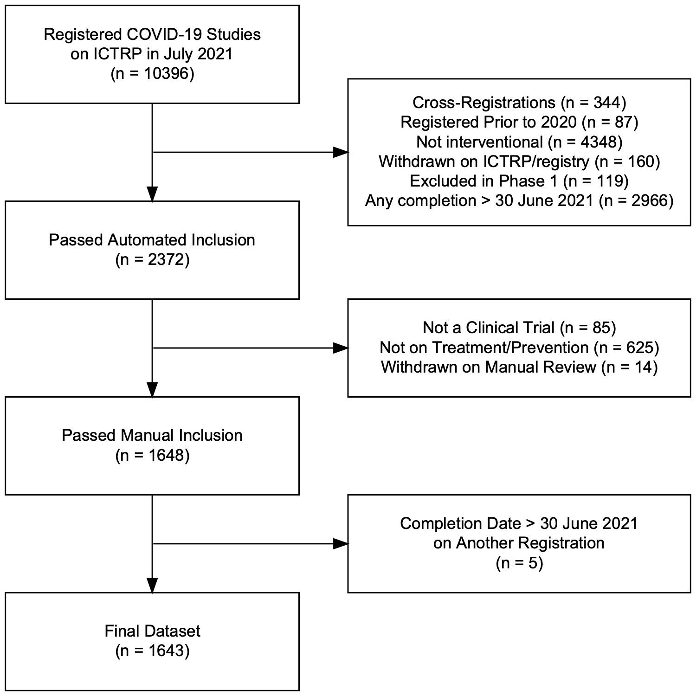

<!-- README.md is generated from README.Rmd. Please edit that file -->

# DIRECCT

# Data

# Directory Structure

The `data` directory has the below structure of subdirectories. Data
pushed to remote is shown below and is limited to `reporting` and data
files that are not code-generated.

    ├── cleaned
    │   ├── registrations.csv
    │   ├── results.csv
    │   └── trials.csv
    ├── manual
    ├── processed
    ├── raw
    │    └── numbat
    └── reporting
        ├── 2021-07-01_ictrp.csv
        ├── 2021-07_registries.csv
        ├── 2022-04_registries.csv
        ├── extraction-info.csv
        ├── metadata
        │   ├── codebook.csv
        │   └── datamodel.pdf
        ├── registrations.csv
        ├── results.csv
        ├── arms.csv
        └── screening-trials.csv

`raw` contains data downloaded from other sources by
`01_download-data-raw.R` and extractions in Numbat by
`03_download-data-numbat.R`.

`manual` contains any data manually added to the repository. Some
additional manual data is read in from Google Sheets.

`cleaned` contains data after cleaning, including tidying names to for
consistency across tables.

`processed` contains intermediary data, i.e. with unique database
identifiers (`id`) in all tables, after deduplicating
cross-registrations, and matched preprint-article results.

`reporting` contains the final data for analysis and dissemination.

## Data model

This data model includes all `reporting` data.

## Codebook

| table                                          | variable                     | type      | description |
|:-----------------------------------------------|:-----------------------------|:----------|:------------|
| 2021-07-01_ictrp;registries                    | web_address                  | character | NA          |
| registrations;2021-07-01_ictrp;registries      | registry                     | character | NA          |
| registrations;arms;2021-07-01_ictrp;registries | trn                          | character | NA          |
| registrations;results;arms;extraction-info     | id                           | character | NA          |
| 2021-07-01_ictrp                               | countries                    | character | NA          |
| 2021-07-01_ictrp                               | date_enrollement             | date      | NA          |
| 2021-07-01_ictrp                               | date_registration            | date      | NA          |
| 2021-07-01_ictrp                               | euctr_country                | character | NA          |
| 2021-07-01_ictrp                               | phase                        | character | NA          |
| 2021-07-01_ictrp                               | public_title                 | character | NA          |
| 2021-07-01_ictrp                               | recruitment_status           | character | NA          |
| 2021-07-01_ictrp                               | retrospective_registration   | logical   | NA          |
| 2021-07-01_ictrp                               | study_type                   | character | NA          |
| 2021-07-01_ictrp                               | target_enrollment            | character | NA          |
| arms                                           | category                     | character | NA          |
| arms                                           | control_type                 | character | NA          |
| arms                                           | intervention                 | character | NA          |
| arms                                           | intervention_plus_soc        | character | NA          |
| arms                                           | placebo_plus_soc             | character | NA          |
| arms                                           | type                         | character | NA          |
| extraction-info                                | comments                     | character | NA          |
| extraction-info                                | dual_coded                   | logical   | NA          |
| extraction-info                                | dual_coded_intervention      | logical   | NA          |
| extraction-info                                | incidental_screening         | logical   | NA          |
| extraction-info                                | incidental_screening_changes | logical   | NA          |
| extraction-info                                | incidental_screening_comment | character | NA          |
| extraction-info                                | soc                          | character | NA          |
| extraction-info                                | timestamp_finished           | POSIX     | NA          |
| extraction-info                                | trn_extracted                | character | NA          |
| registrations                                  | ids_old                      | character | NA          |
| registrations                                  | resolved                     | logical   | NA          |
| registries                                     | last_updated                 | date      | NA          |
| registries                                     | other_results_1              | character | NA          |
| registries                                     | other_results_2              | character | NA          |
| registries                                     | pcd                          | date      | NA          |
| registries                                     | potential_other_results      | logical   | NA          |
| registries                                     | rcd                          | date      | NA          |
| registries                                     | reg_results_status           | character | NA          |
| registries                                     | registry_scrape_date         | character | NA          |
| registries                                     | scd                          | date      | NA          |
| registries                                     | tabular_results              | logical   | NA          |
| registries                                     | trial_status                 | character | NA          |
| results                                        | date_completion              | date      | NA          |
| results                                        | date_completion_reported     | character | NA          |
| results                                        | date_final_enrollment        | date      | NA          |
| results                                        | date_publication             | date      | NA          |
| results                                        | doi                          | character | NA          |
| results                                        | estimated_cd_enrollment      | logical   | NA          |
| results                                        | followup_primary             | numeric   | NA          |
| results                                        | followup_secondary           | numeric   | NA          |
| results                                        | full_pub_group               | numeric   | NA          |
| results                                        | pmid                         | numeric   | NA          |
| results                                        | pub_type                     | character | NA          |
| results                                        | search_engine                | character | NA          |
| results                                        | search_type                  | character | NA          |
| results                                        | url                          | character | NA          |

## Screening flowchart

- Cross-registrations include any duplicates identified at any stage and
  includes those automatically and manually discovered in the registry
  or in publications
- TODO: Specify which criteria are any/all for cross-registrations

